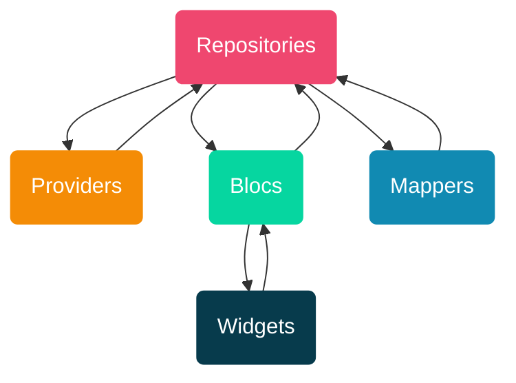
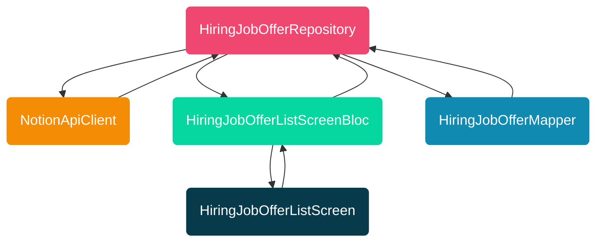

# App Offertelavoroflutter.it
App realizzata per l'Hackathon di Fudeo.

## IMPORTANTE: Per eseguire l'app è necessario creare il file `.env`
Per creare il file `.env` basta lanciare il seguente comando (dalla root del progetto Flutter):

    cp environment/example.env environment/.env

Una volta creato il file `.env` è necessario aprilo e popolarlo con la chiave per l'accesso alle API di Notion:

    NOTION_API_KEY="secret_..."

Fatto! L'app è pronta per essere eseguita 🚀

## Funzionalità

✅ Elenco annunci per assunzioni e per freelance con infinite scroll e paginazione

✅ Pull to refresh

✅ Ricerca testuale e filtri (server-side, implementati utilizzando le API di Notion)

✅ Link ai form per iscriversi alla newsletter

✅ Preferiti

✅ Share

✅ Onboarding

✅ Sezione "Risorse" con Webview che rimanda all'Ecosistema Flutter in Italia

✅ Sezione "Pubblica" con link ai form per pubblicazione degli annunci

✅ Animazioni

✅ I18N ready

## Architettura
L'architettura utilizzata prende ispirazione dall'architettura "Pine": https://angeloavv.medium.com/pine-a-lightweight-architecture-helper-for-your-flutter-projects-1ce69ac63f74

Ecco un esempio concreto dell'architettura per quanto riguarda l'elenco degli annunci per assunzione:

## Versione Flutter
L'app si basa su FVM per gestire la versione di Flutter utilizzata:
https://fvm.app/

Per installare la versione corretta di Flutter basta lanciare il seguente comando:

    fvm install

Tutti i comandi `flutter` vanno modificati anteponendo `fvm`, es:

    flutter clean

diventa

    fvm flutter clean

Seguire la documentazione di FVM per configurare VScode o Android Studio in modo da utilizzare in automatico la versione corretta di Flutter: https://fvm.app/docs/getting_started/configuration#ide

## Generazione icone
L'icona dell'app è stata generata utilizzando il package: https://pub.dev/packages/flutter_launcher_icons. 

Per eseguire la generazione dell'icona basta lanciare il seguente comando:

    fvm flutter pub run flutter_launcher_icons

## Generazione splash screen
La splash screen dell'app è stata generata utilizzando il package: https://pub.dev/packages/flutter_native_splash

Per eseguire la generazione della splash screen basta lanciare il seguente comando:

    fvm flutter pub run flutter_native_splash:create

## Generazione DTO
L'app usa il package `freezed` per la generazione dei DTO (e degli eventi e stati dei Bloc): https://pub.dev/packages/freezed

Per eseguire la generazione dei DTO basta lanciare il seguente comando:

    fvm flutter pub run build_runner build --delete-conflicting-outputs
